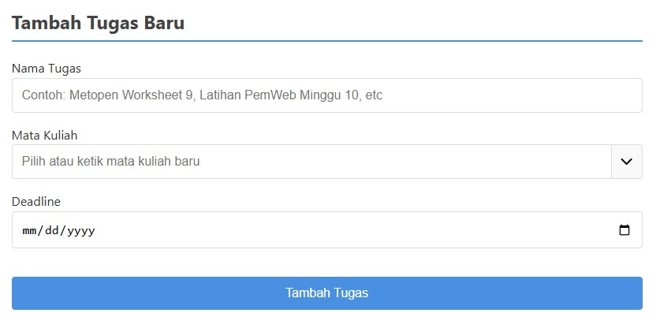
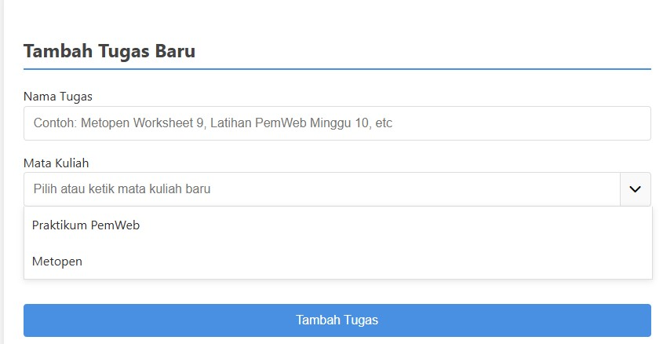
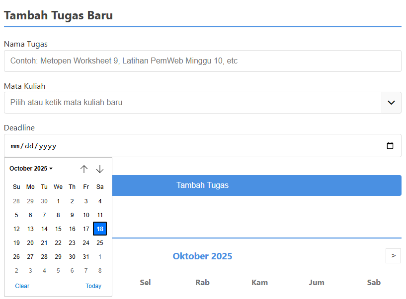
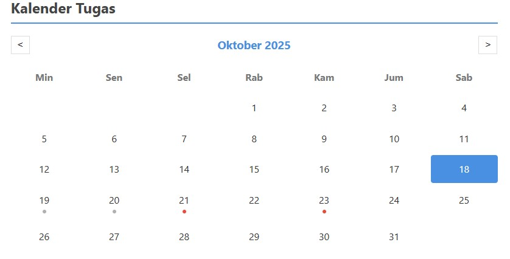
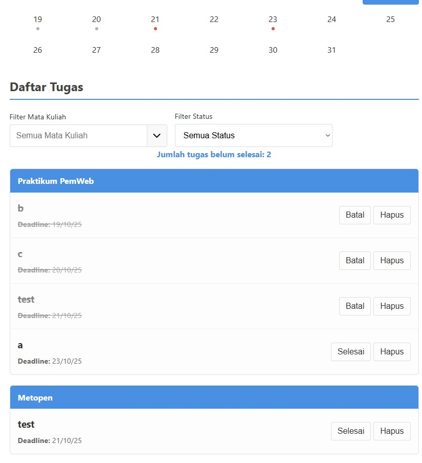
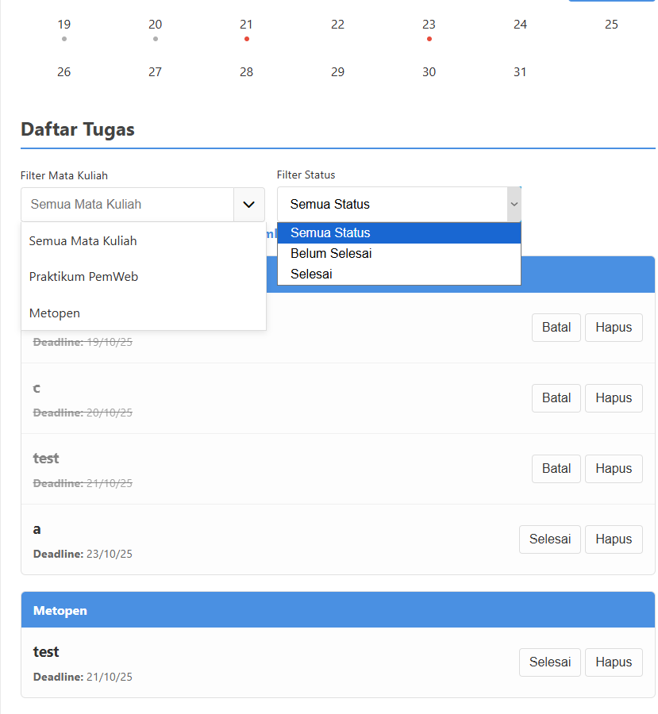

## Penjelasan Singkat dan Fitur-fitur

Aplikasi ini berfungsi sebagai agenda digital pribadi bagi mahasiswa. Pengguna dapat dengan cepat menambahkan tugas baru, lengkap dengan mata kuliah dan tanggal *deadline*. Fitur utamanya adalah **kalender interaktif** yang memberikan visualisasi *deadline* secara jelas, serta **daftar tugas yang otomatis dikelompokkan** per mata kuliah dan diurutkan berdasarkan tanggal *deadline* terdekat. Semua data disimpan secara lokal di browser, sehingga tugas tidak akan hilang bahkan setelah browser ditutup.

---

## Cara Menggunakan Aplikasi

Berikut adalah panduan langkah demi langkah untuk menggunakan fitur-fitur utama aplikasi:

#### Menambah Tugas Baru
1.  Isi **Nama Tugas**, **Mata Kuliah**, dan pilih **Deadline** pada form di bagian atas.
2.  Untuk Mata Kuliah, Anda bisa mengetik nama baru atau memilih dari daftar yang sudah ada dengan menekan ikon panah.
3.  Klik tombol **"Tambah Tugas"**. Tugas akan otomatis muncul di kalender dan di daftar tugas di bawah.

#### Mengelola Daftar Tugas
-   **Menandai Selesai:** Klik tombol **"Selesai"** pada sebuah tugas. Tulisannya akan tercoret, dan indikator di kalender akan berubah menjadi abu-abu. Klik tombol **"Batal"** untuk mengembalikannya.
-   **Menghapus Tugas:** Klik tombol **"Hapus"** untuk menghilangkan tugas secara permanen.

#### Menggunakan Kalender dan Filter
-   **Melihat Deadline:** Tanggal di kalender akan memiliki titik di bawahnya jika ada tugas pada hari itu (**merah** = belum selesai, **abu-abu** = sudah selesai).
-   **Filter Berdasarkan Tanggal:** Klik pada tanggal mana pun di kalender untuk menampilkan hanya tugas-tugas dengan *deadline* pada hari itu. Untuk kembali, klik lagi tanggal yang sama atau tombol **"Matikan Filter Tanggal"**.
-   **Filter Berdasarkan Mata Kuliah/Status:** Gunakan *dropdown* di bawah kalender untuk menyaring tugas berdasarkan mata kuliah atau statusnya.

---

## Daftar Fitur yang Telah Diimplementasikan

-   **Fungsionalitas CRUD:**
    -   **Create:** Menambah tugas baru melalui form.
    -   **Read:** Menampilkan semua tugas dalam daftar yang terorganisir.
    -   **Update:** Menandai tugas sebagai "Selesai" atau "Batal" jika ingin merubah tugas yang selesai menjadi belum selesai.
    -   **Delete:** Menghapus tugas.
-   **Penyimpanan Lokal:** Semua data tugas disimpan secara otomatis di `localStorage`.
-   **Kalender Interaktif:**
    -   Menampilkan *deadline* tugas dengan indikator warna (merah untuk belum selesai, abu-abu untuk sudah selesai).
    -   Berfungsi sebagai filter tanggal saat diklik.
-   **Filter & Pencarian:**
    -   Filter tugas berdasarkan Mata Kuliah melalui *dropdown*.
    -   Filter tugas berdasarkan Status (Semua, Selesai, Belum Selesai).
-   **Pengelompokan & Pengurutan:**
    -   Daftar tugas otomatis dikelompokkan per mata kuliah.
    -   Tugas diurutkan otomatis berdasarkan *deadline* terdekat.
-   **Statistik Tugas:** Menampilkan jumlah tugas yang belum selesai secara *real-time*.
-   **Validasi Form:** Mencegah pengiriman data yang tidak valid atau kosong.

---

## Penjelasan Teknis

#### Penggunaan `localStorage`

Aplikasi ini memanfaatkan Web Storage API untuk memastikan data tugas pengguna tidak hilang.

-   **Penyimpanan Data**: Setiap kali ada perubahan data (menambah, menghapus, atau mengubah status tugas), fungsi `saveDataAndRefreshUI()` dipanggil. Di dalamnya, baris `localStorage.setItem('tasks', JSON.stringify(tasks));` akan mengubah array `tasks` menjadi format string JSON dan menyimpannya di browser pengguna dengan *key* `'tasks'`.
-   **Pengambilan Data**: Saat halaman pertama kali dimuat, baris `var tasks = JSON.parse(localStorage.getItem('tasks')) || [];` akan dieksekusi. Kode ini mencoba mengambil data dari `localStorage` menggunakan *key* `'tasks'`. Jika data ada, `JSON.parse()` akan mengubahnya kembali menjadi array JavaScript. Jika tidak ada data (misalnya saat pertama kali membuka aplikasi), sebuah array kosong `[]` akan digunakan sebagai nilai *default*.

#### Validasi Form

Untuk memastikan integritas data, aplikasi menerapkan dua lapis validasi:

1.  **Validasi Sisi Klien (HTML):** Pada file `index.html`, setiap elemen `<input>` yang wajib diisi memiliki atribut `required`. Ini adalah mekanisme pertahanan pertama yang disediakan oleh browser untuk mencegah form dikirim jika ada kolom yang kosong.
2.  **Validasi Sisi Skrip (JavaScript):** Sebelum data baru ditambahkan ke array `tasks`, fungsi `addTask()` di `index.js` melakukan pengecekan ulang dengan baris `if (!name || !course || !deadline)`. Jika salah satu dari variabel ini kosong, sebuah `alert` akan ditampilkan kepada pengguna, dan proses penambahan tugas akan dihentikan. Ini memastikan tidak ada data yang tidak lengkap yang masuk ke dalam sistem.

## Screenshot Aplikasi

Berikut adalah beberapa screenshot yang menunjukkan fitur-fitur utama aplikasi:

**1. Menambahkan Tugas Baru**
 

 
*Form untuk menambah tugas baru, dengan *dropdown* untuk memilih mata kuliah yang sudah ada.*

**2. Kalender Tugas**
 

 
*Menunjukkan kalender dimana tanggal memiliki simbol merah jika ada tugas yang belum selesai dan simbol abu-abu jika ada tugas yang sudah selesai di tanggal tersebut*

**3. Fitur Filter**
 

 
*Contoh penggunaan filter dengan memilih tanggal di kalender dan memfilter berdasarkan mata kuliah tertentu dari *dropdown*.*

---

Jika ingin mencoba aplikasi secara langsung bisa mengunjungi link berikut:
https://protoflicker.github.io/tugasmanager/