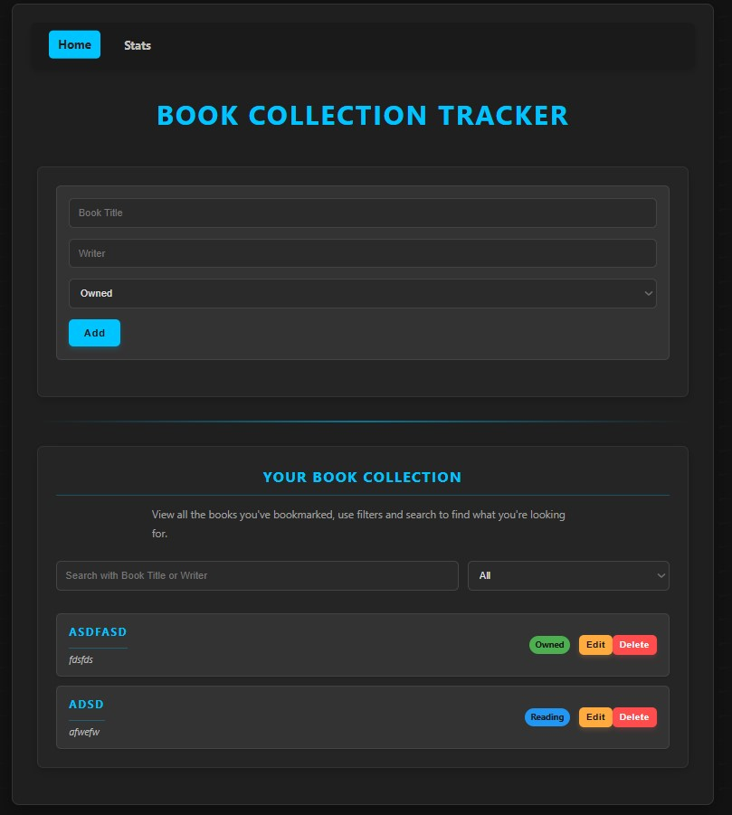
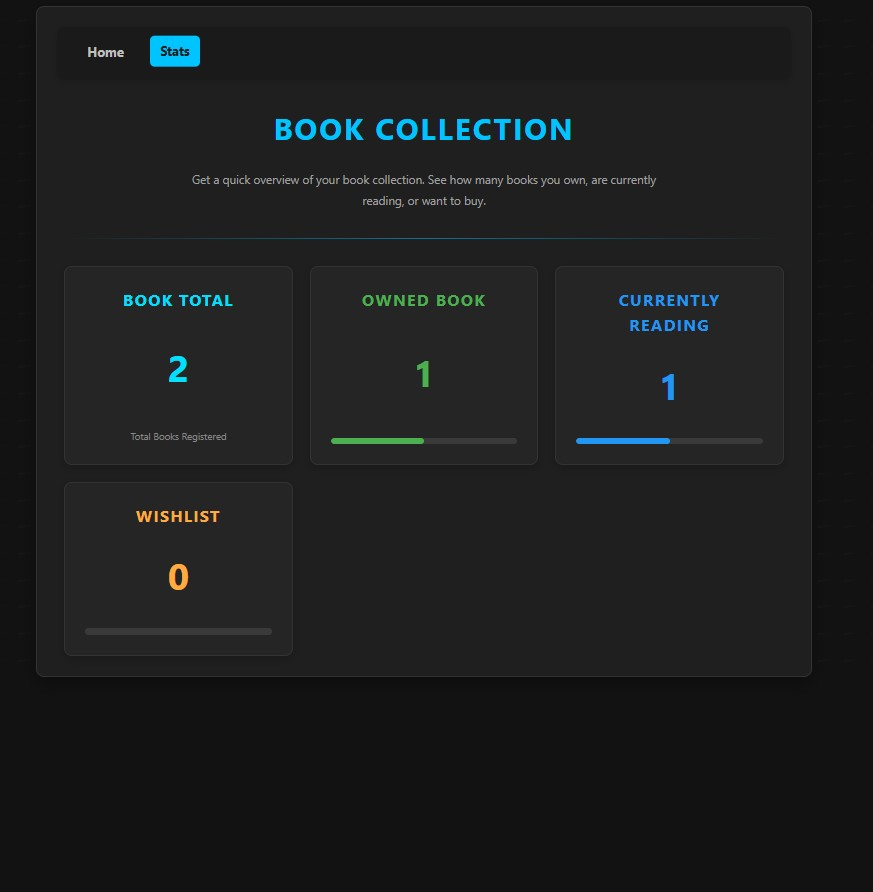
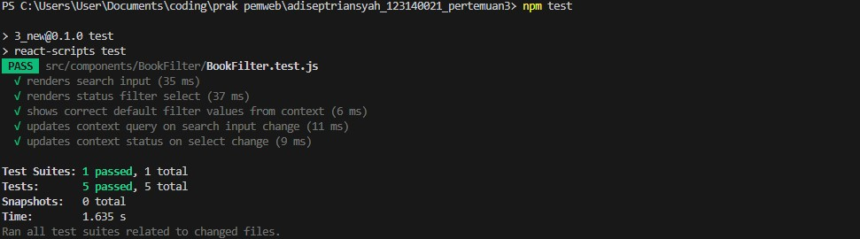

# Aplikasi Manajemen Buku Pribadi (React)

Ini adalah proyek yang dibuat untuk Praktikum React Dasar. Aplikasi ini adalah Single Page Application (SPA) yang memungkinkan pengguna untuk mencatat dan mengelola koleksi buku pribadi.

Aplikasi ini dibangun menggunakan React Hooks, Context API, Custom Hooks, dan React Router.

---

## Instruksi Instalasi dan Menjalankan

Pastikan Node.js dan npm sudah terinstal.

1. Clone Repository  
   Perintah: git clone <url-repository-anda> <nama-folder>

2. Masuk ke Direktori Proyek  
   Perintah: cd <nama-folder>

3. Instal Dependensi  
   Perintah: npm install

4. Jalankan Aplikasi (Development Server)  
   Aplikasi berjalan di http://localhost:3000  
   Perintah: npm start

5. Menjalankan Test  
   Menjalankan 5 unit test  
   Perintah: npm test

---

## Screenshot Antarmuka

Halaman Utama (Home)  

Halaman Statistik  

---

## Penjelasan Fitur React yang Digunakan

Aplikasi ini dibangun menggunakan Functional Components, Hooks, Context API, Custom Hooks, dan React Router.

### Functional Components & Hooks

- Semua komponen menggunakan functional components.
- useState untuk mengelola state lokal seperti form dan filter.
- useEffect digunakan dalam useLocalStorage untuk sinkronisasi otomatis dengan localStorage.

### Context API (State Management Global)

- BookContext.js mengelola state global.
- Menyediakan books, filteredBooks, serta fungsi CRUD:
  - addBook
  - updateBook
  - deleteBook

### Custom Hooks

- useLocalStorage.js  
  Abstraksi interaksi dengan localStorage, otomatis sinkron dengan state React.

- useBookStats.js  
  Menghitung statistik buku (total, milik, baca, beli) untuk kebutuhan komponen Stats.

### React Router (react-router-dom)

- Menggunakan BrowserRouter, Routes, dan Route.
- Halaman:
  - /  → Home
  - /stats  → Statistik
- NavLink digunakan untuk navigasi dengan style aktif.

### Error Handling (Form Input)

- Validasi input dilakukan dalam handleSubmit di BookForm.js.
- Jika judul atau penulis kosong, pesan error ditampilkan.

---

## Laporan Testing

Minimal 5 unit test dibuat dengan React Testing Library dan Jest.  
Test berfokus pada komponen BookFilter dan interaksinya dengan BookContext.

### Screenshot Hasil Test

---
